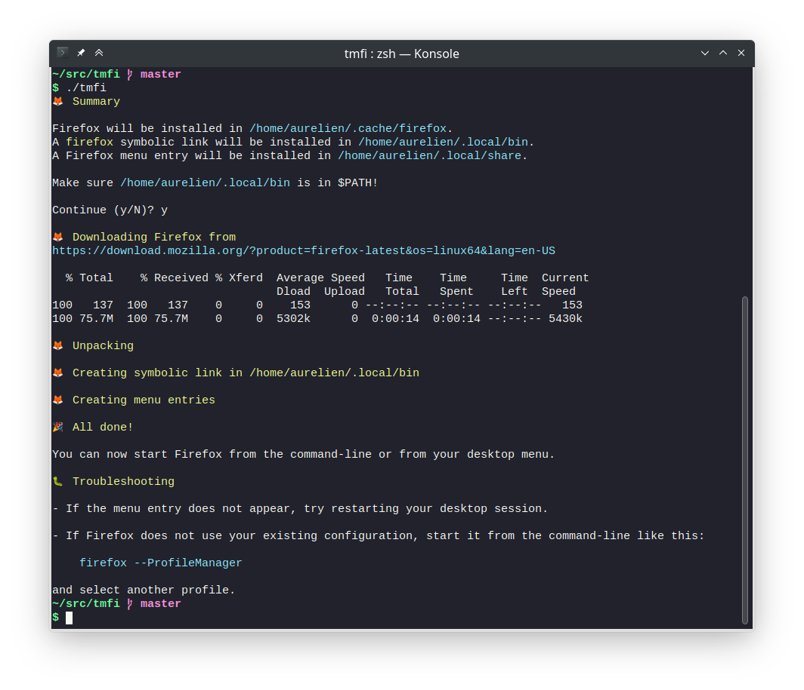

# tmfi - The missing Firefox installer



Mozilla provides prebuilt versions of Firefox for macOS, Windows and Linux. Unfortunately, the Linux version is just a tarball, so it does not create a menu entry or install itself in $PATH.

`tmfi` fixes this. It's a script which:

- Downloads the latest Firefox Linux archive
- Creates a symbolic link in `$HOME/.local/bin`
- Installs a menu entry in `$HOME/.local/share` (or in `$XDG_DATA_HOME` if it's defined)

## Usage

Clone this repository:

```
git clone https://github.com/agateau/tmfi
```

Run the script:

```
cd tmfi
./tmfi
```

Optionally, specify the language with `./tmfi --lang LANGUAGE_CODE` (Have a look at <https://download-installer.cdn.mozilla.net/pub/firefox/releases/latest/README.txt> for the list of supported languages).

## What about updating?

The Firefox binaries provided by Mozilla auto-update themselves, so there is no need to re-run the script later.
